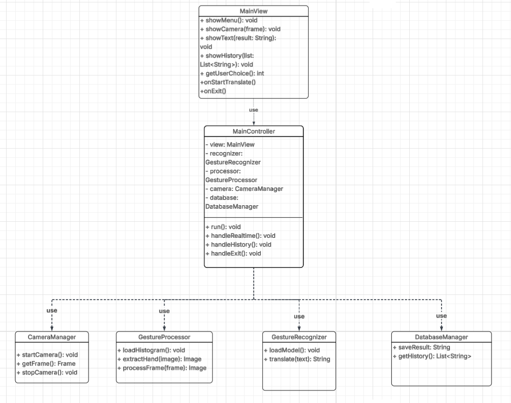
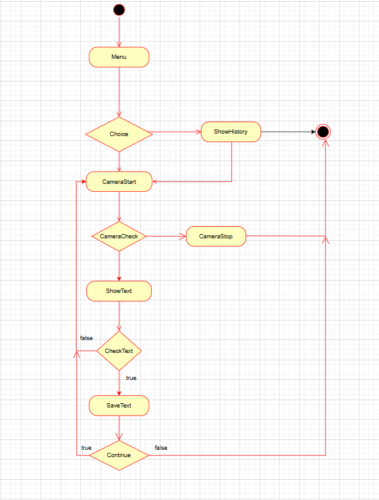

# Syltalky

## Mô tả ý tưởng

- **Syltalky** là một web app phiên dịch hỗ trợ người khiếm thính và người khiếm thị. Ứng dụng sử dụng camera của máy tính để thu nhận hình ảnh cử chỉ tay của người dùng, hình ảnh chữ nổi cần dịch, văn bản cần dịch thành dạng chữ nổi, …. Hệ thống AI sau đó phân tích hình ảnh, nhận diện đầu vào và chuyển đổi chúng thành văn bản hoặc lời nói tương ứng.
- Ứng dụng được thiết kế với giao diện trực quan để người dùng có thể dễ dàng sử dụng. Khi người dùng thực hiện một ký hiệu trước camera, hệ thống sẽ xử lý hình ảnh theo thời gian thực và hiển thị kết quả dịch trên màn hình. Người dùng cũng có thể cung cấp hình ảnh chữ nổi để hệ thống dịch ra hoặc cung cấp văn bản để hệ thống dịch thành dạng chữ nổi. Ngoài ra, ứng dụng có thể hỗ trợ lưu lại lịch sử các câu đã nhận diện hoặc chuyển đổi văn bản thành giọng nói nhằm hỗ trợ giao tiếp thuận tiện hơn.
- Mục tiêu của dự án là xây dựng một công cụ hỗ trợ giao tiếp giữa người sử dụng ngôn ngữ ký hiệu và những người không hiểu ngôn ngữ ký hiệu, từ đó giúp giảm rào cản trong giao tiếp hàng ngày.

## Đối tượng hướng tới

- Ứng dụng hướng tới nhiều nhóm người dùng khác nhau:
    - Người khiếm thính, khiếm thị hoặc người sử dụng ngôn ngữ ký hiệu: giúp họ dễ dàng giao tiếp với những người không hiểu ngôn ngữ ký hiệu bằng cách chuyển đổi cử chỉ tay, chữ nổi thành văn bản hoặc giọng nói và ngược lại.
    - Người không biết ngôn ngữ ký hiệu: hỗ trợ họ hiểu được nội dung mà người sử dụng ngôn ngữ ký hiệu muốn truyền đạt mà không cần phải học trước ngôn ngữ ký hiệu.
    - Sinh viên, nhà nghiên cứu và giáo viên trong lĩnh vực công nghệ hoặc giáo dục đặc biệt: có thể sử dụng ứng dụng như một công cụ hỗ trợ học tập, nghiên cứu hoặc minh họa trong các bài giảng liên quan đến trí tuệ nhân tạo, thị giác máy tính và ngôn ngữ ký hiệu.
  
- Thông qua việc hướng tới các nhóm người dùng này, dự án kỳ vọng góp phần tạo ra một môi trường giao tiếp thuận tiện hơn, đồng thời nâng cao khả năng tiếp cận công nghệ cho cộng đồng người khiếm thính.

## MVP của Syltalky

- MVP: Dùng camera/webcam dịch cử chỉ tay của người thực hiện. Hiển thị phụ để thời gian thực. Lưu kết quả cuối dưới dạng text.

- Giao diện người dùng cơ bản.

- 3 tính năng: Dịch thời gian thực, Lịch sử dịch, Thoát phần mềm.

Hậu MVP có thể có:

- Dịch cử chỉ từ một video được đăng tải lên
- Dịch Braile sang text
- Dịch ngược lại từ text => Cử chỉ & Braile (khó)
- Giao diện người dùng tốt hơn.

## Công nghệ sử dụng

- Ngôn ngữ: Java
- Giao diện: JavaFX + Scene Builder

## Thiết kế hệ thống

### Class Diagram

### Activity Diagram

## Link Demo
